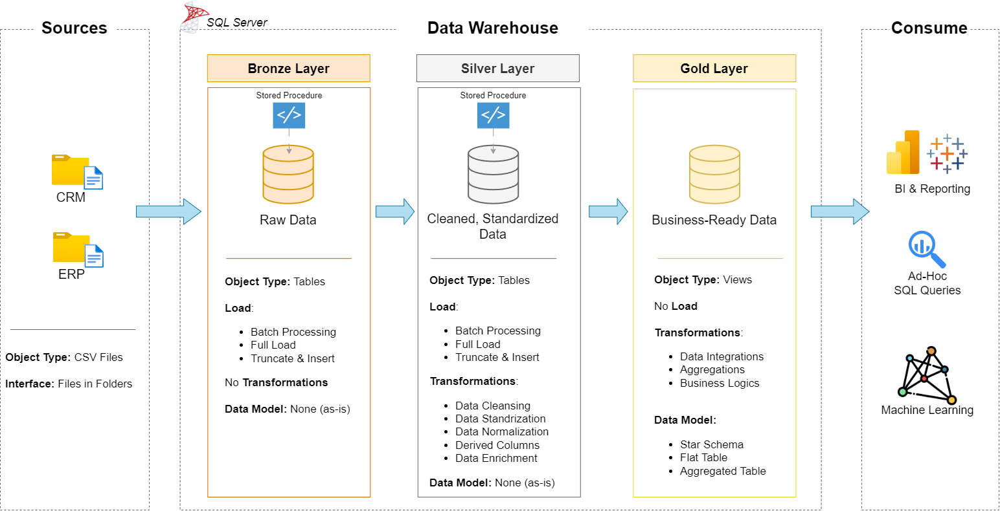

# 📊 SQL Data Warehouse from Scratch

This project demonstrates how to build a **modern data warehouse** using **SQL Server** from the ground up. It includes **data modeling**, **ETL processes**, and **analytics-ready layers** following the Medallion Architecture: **Bronze**, **Silver**, and **Gold**.

---

## 🚀 Project Overview

The project simulates a real-world data warehousing scenario, integrating data from ERP and CRM systems, transforming it through structured layers, and delivering a business-friendly model for analytics.

Key components include:

- **Data Architecture**: Designed using the Medallion architecture (Bronze → Silver → Gold)
- **ETL Pipelines**: Built with SQL stored procedures for data flow across layers
- **Data Modeling**: Fact and dimension tables for analytics (Star Schema)
- **SQL-Based Analytics**: Queries and views to support data insights

---

## 🧱 Data Architecture

The project follows the Medallion Architecture:

- **Bronze Layer**: Raw staging tables reflecting the source data
- **Silver Layer**: Cleansed, deduplicated, and integrated datasets
- **Gold Layer**: Final fact and dimension tables, optimized for reporting

---

## 🎯 Objective

To build a clean, integrated, and analytics-ready **data warehouse** that enables efficient reporting and decision-making based on **customer and product sales data**.

---

## 📋 Project Specifications

### 🔹 Data Sources
- **ERP and CRM data** provided as `.csv` files
- Ingested using `BULK INSERT` into Bronze layer

### 🔹 ETL Pipeline Logic
- **Bronze Layer**: Truncate + bulk load raw CSV files
- **Silver Layer**: Cleanse and join data, remove duplicates
- **Gold Layer**: Create star schema with fact and dimension views

### 🔹 Data Modeling
- **Fact Table**:
  - `gold.fact_sales`
- **Dimension Tables**:
  - `gold.dim_customers`
  - `gold.dim_products`

### 🔹 Integration Scope
- One-time load; no historical data tracking (no SCD)
- Assumes latest snapshot of source systems

### 🔹 Documentation
- Schema-level documentation and detailed table catalogs
- Commented scripts and procedures for maintainability

---
